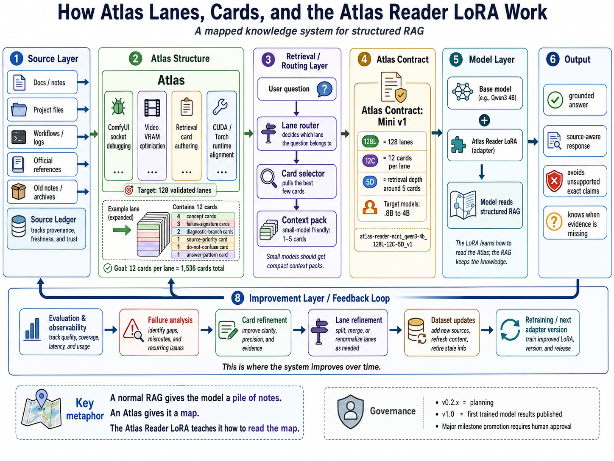
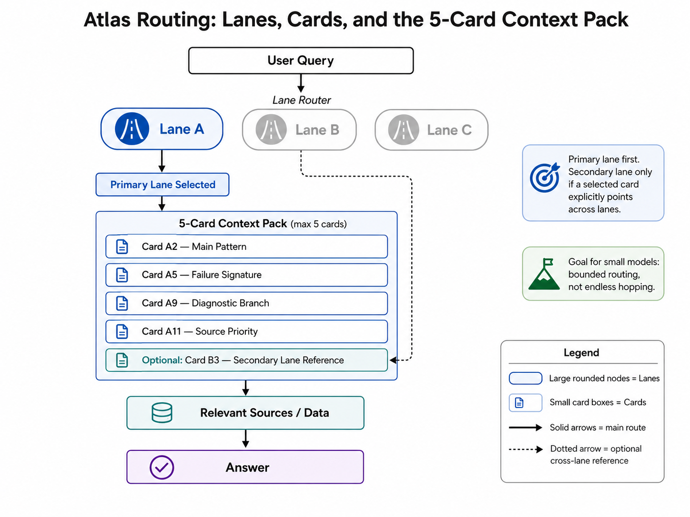
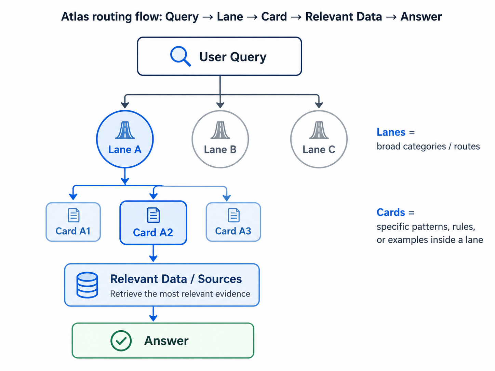

# AI Without Fear — Atlas Reader LoRA Lab

Status: public-facing landing draft  
Version added: v0.2.9-dev16  
Date: 2026-05-22

## What this is

AIWF Atlas Reader LoRA is a structured-RAG research lab.

It tests whether a small LoRA adapter can learn how to read a versioned Atlas:

```text
query
→ lane
→ card pack
→ source rules
→ answer
```

The Atlas keeps the knowledge.

The adapter learns the reading behavior.

## Visual overview



**What the LoRA adapter is:** the Atlas keeps the knowledge; the adapter is tested as a portable reading behavior for that structure.



**How the cards work:** selected cards form a compact context pack so small models get a map instead of an all-you-can-eat buffet of notes.



**How lanes route the query:** lanes act as broad routes; cards inside the lane point the model toward the relevant evidence.

## Why this fits AI Without Fear

AI Without Fear is built around a simple idea:

```text
Master principles, not platforms.
```

Tools change.

Principles transfer.

This project applies that same idea to RAG and fine-tuning:

```text
Do not make the model memorize the whole library.
Teach it how to navigate the library.
Then test whether that navigation transfers.
```

## Current build status

```text
seed lanes: 18
seed cards: 216
citation records: 26
diagrams: 3
trained adapters: 0
completed training runs: 0
```

## What has been built

- Atlas lane/card system;
- 5-card context-pack design;
- source/citation registry;
- runnable QLoRA training layer;
- TensorBoard dashboard support;
- Python 3.10 lab installer;
- smoke-evaluation protocol;
- public review checklists.

## What has not been proven yet

This project has not proven:

- Atlas RAG beats raw RAG;
- Atlas Reader LoRA improves Atlas RAG;
- small models match larger models;
- the adapter transfers across domains.

Those are not slogans.

They are experiments waiting for run logs.

## The next proof step

The next proof step is the smoke train:

```text
base model + Atlas RAG
vs
base model + Atlas Reader LoRA + Atlas RAG
```

If the adapter helps, the results should show it.

If the adapter fails, the failure should be documented clearly enough that the next builder does not step on the same rake in the dark.

## Pre-install / no-results guard

This project has not yet been installed on the target PC.

No adapter has been trained.

No evaluation result exists yet.

Prepared scripts, templates, and diagrams are not wins; they are the test bench.
